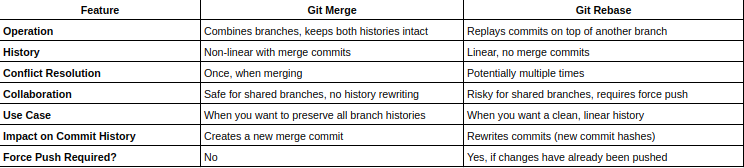
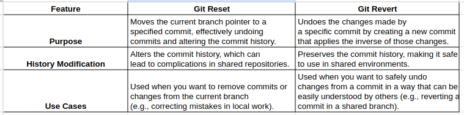

## Advanced Git
- Advanced Git refers to the more complex features and tools in Git that are used to handle tricky situations or optimize workflows in larger, more complex projects. 
- Advanced Git helps us manage history, resolve conflicts, and keep our project organized when things get complicated.

### 1. Git rebase
- Applies your changes on top of another branch's history. Unlike merging, it replays your commits on top of the target branch's latest state, producing a linear history.
    #### a. Standard Rebase:
    - ```git rebase specified-branch```: Rebases your current branch on top of the specified branch.
    - Example: Below command takes your ```feature-branch``` and replays all of its commits on top of the ```main``` branch.
        ```
        git checkout feature-branch
        git rebase main
        ```
    #### b. Interactive Rebase:
    - Allows you to modify your commit history (e.g., reordering commits, squashing multiple commits into one, editing commit messages).
    - Example: Below command opens an editor where you can interactively choose what to do with **the last 3 commits**.
        ```
        git rebase -i HEAD~3
        ```
**Detailed Rebase Process**
- Let’s say you have the following situation:
    ```
    main
    |
    A---B---C        (main)
        |
        D---E---F  (feature-branch)
    ```
- Now, you want to move **feature-branch** to be on top of the latest **main** branch (after commit C). 

**Before rebase**:
- The commits D, E, and F in feature-branch are based on an older version of main (commit B).

**After rebase**
- By running below commands:
    ```
    git checkout feature-branch
    git rebase main
    ```
- Git will apply the changes made in D, E, and F to the latest commit on main (commit C), effectively replaying those changes on top of it.
    ```
    main
    |
    A---B---C    (main)
            |
            D'---E'---F'  (feature-branch)
    ```
- Here, D', E', and F' are new commits that represent the same changes as D, E, and F, but rebased on top of commit C.

#### Difference between Git rebase and Git merge
**Merge**: When you merge, Git combines the two branches into one but keeps the history of both, which can result in a "merge commit" and a more complex history:
```
A---B---C---M
    \     /
    D---E---F
```
- Pros of Merge: 
    + Preserve complete history or avoid rewriting history.
    + Merge commit can sometimes cause look messy, but display clearly the evolution of features.

**Rebase**: Rebasing, on the other hand, avoids creating merge commits by rewriting history so that your commits appear as if they were made after the latest changes:
```
A---B---C---D'---E'---F'
```
- Pros of Rebase: 
    + Cleaner, linear history
    + Avoid unnecessary commits

- Image below describes in detail the difference between Git merge and git rebase. 



### 2. Git cherry-pick
- Git cherry-pick allows you to apply the changes introduced by a specific commit (or multiple commits) from one branch to another. Instead of merging an entire branch, cherry-pick lets you select individual commits and apply them to your current branch.
- Common ```git cherry-pick``` scenarios:
    + Isolate specific features, grab a single commit. Let’s say commit ```featureA``` on ```feature``` fixes a bug, and you want that bug fix in the ```main``` branch:
        ```
        git checkout main
        git cherry-pick featureA
        ```
    + Cherry-pick multiple commits. This applies changes from multiple specific commits.
        ```
        git cherry-pick <commitA> <commitB> <commitC>
        ```
    + Handle merge conflicts during cherry-pick. If conflicts occur during cherry-picking, you will need to resolve them manually and then run
        ```
        git cherry-pick --continue
        ```

### 3. Git stash
- Git stash is a git feature which temporarily saves uncommitted changes so you can work on something else without committing or losing your current work.

- Why using ```git stash```:
    + Save changes locally without dummy commit when suddenly switching to other task.
    + When done with ad-hoc task, you can go back and apply changes.
- Common ```git stash``` commands:
    + ```git stash``` / ```git stash save```: Saves your uncommitted changes. Assume you add file_1.txt
        ```
        git stash save 'Add file 1'
        ```
        Example output:
        ```
        Saved working directory and index state On main: Add file 1
        ```
    + ```git stash -u```: Stashes untracked (new) files beside tracked files.
    + ```git stash list```: Shows all the stashes you have saved. Example output:
        ```
        stash@{0}: On main: Add file 1
        ```
    + ```git stash apply``` / ```git stash apply stash@{N}```: Re-applies the last / specified stashed changes  without removing them from the stash list. Example output will be:
        ```
        Your branch is up to date with 'origin/main'.

        Changes to be committed:
        (use "git restore --staged <file>..." to unstage)
            new file:   example/file_1.txt
        ```
    + ```git stash pop``` / ```git stash pop stash@{0}``` : Re-applies the last / specified stashed changes and removes them from the stash list.
    + ```git stash drop [stash@{N}]```: Removes a specific stash without applying it.
    + ```git stash clear```: delete all stashed changes in repository. After deleting, we can not retrive these changes anymore.


### 4. Git reset

- Git reset is used to undo changes in commits, unstage files, or even discard uncommitted changes.

- Common ```git reset``` scenarios:
    + ```git reset --soft HEAD~1```: Undo to the last commit, keep changes staged.
    + ```git reset --mixed HEAD~n```: Undo to the ```n``` th commit, unstage changes, keep working directory intact. This is also **default** mode of git reset.
    + ```git reset --hard HEAD~1```: Undo to previous commit, unstage changes, and delete all modifications from the working directory. **All uncommitted changes** will be lost, so use this with caution

- Easy to understand based on [this thread](https://github.com/orgs/community/discussions/68224)
    ```
    git reset --hard: undos git commit, git add, and changes you've made since last commit
    git reset --mixed: undos git commit and git add
    git reset --soft: undos git commit
    ```

### 5. Git revert
- Git revert undoes a commit by creating a new commit that reverses the changes made by the specified commit, **preserving the commit history**.

- Common ```git revert``` scenarios:
    + **Undo a specific commit**, suppose ```add_file_1``` is the commit you want to revert. Below command creates a new commit that undoes the changes made by ```add_file_1```

        ```
        git revert add_file_1
        ```
    + **Undo Multiple Commits**. Support ```add_file_1```, ```add_file_2```, ```add_file_3``` are reverted commits. This creates three new commits, each undoing one of the specified commits.

        ```
        git revert add_file_1 add_file_2 add_file_3
        ```

    + **Revert a Merge Commit**: A merge commit was made, but it caused issues, and you want to undo the merge. To revert a merge commit, use the ```-m 1```flag to return to the first parent right before *merge-commit-hash*:
        ```
        git revert -m 1 <merge-commit-hash>
        ```

    + **Fix a Bad Hotfix in Production**: A recent hotfix introduced an issue in the production branch. Rather than rewriting history, you can revert the problematic commit and push the fix to production.

        ```
        git revert <commit-hash>
        git push origin main
        ```
**Difference between git reset and git revert**
- Use git reset when you need to modify history locally and are certain it won't affect others.
- Use git revert when working in a collaborative environment and you need to safely undo changes without altering the project's history.



### 6. Git tag
### 7. Git reflog
- Git reflog is a command which tracks all changes to the **HEAD** pointer in your local repository, including **commits, resets, rebases, and checkouts**. It provides a history of actions that move HEAD, even for commits that aren't part of the branch's visible commit history. This helps you recover lost commits and undo mistakes.
- For vietnamese, you could refer [this article](https://viblo.asia/p/git-reflog-phao-cuu-sinh-cho-nhung-loi-lam-hay-gap-tren-git-x7Z4Dja2LnX) 
- Common ```git reflog``` scenarios:
    + **Recover lost commit**. You accidentally used ```git reset --hard``` or deleted a branch, and you need to retrieve a lost commit.
        ```
        git reflog
        git checkout <commit-hash>
        ```
    + **Find the previous branch**. If you checkout to other branch but forget the name of branch
        ```
        git reflog
        git checkout <branch>
        ```
    + **Undo a bad reset**. You reset your branch but want to return to a previous state. 
        ```
        git reflog
        git reset --hard <commit-hash>
        ```
    + **Fix a bad rebase or merge**. After a problem with rebase or merge, recover the branch’s state before the operation.
        ```
        git reflog
        git reset --hard <commit-before-rebase>
        ```

- Notes: Git reflog is your safety net when things go wrong in Git which helps to list out all the commit even they are not visible in git history. Git reflog needs to cooperate with other commands to be effective.