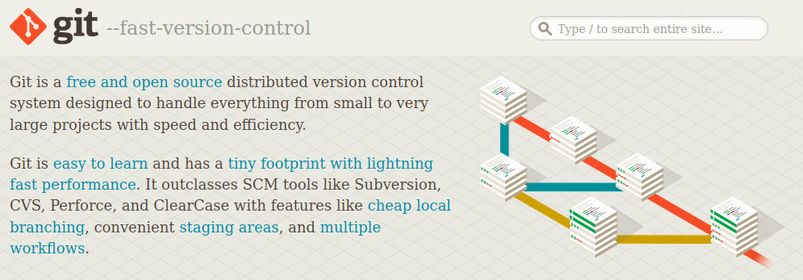

## CoherentGit

[Git](https://git-scm.com/) is a free and open source distributed version control system designed to handle everything from small to very large projects with speed and efficiency. 

### Agenda
1. [Basic Git](BasicGit.md)
- Go through the essentials of Git, like setting up a repository, making changes, creating branches, and working with remotes (e.g., GitHub). 
2. [Advanced Git](AdvancedGit.md)
- Advanced Git helps us manage history, resolve conflicts, and keep our project organized when things get complicated.
